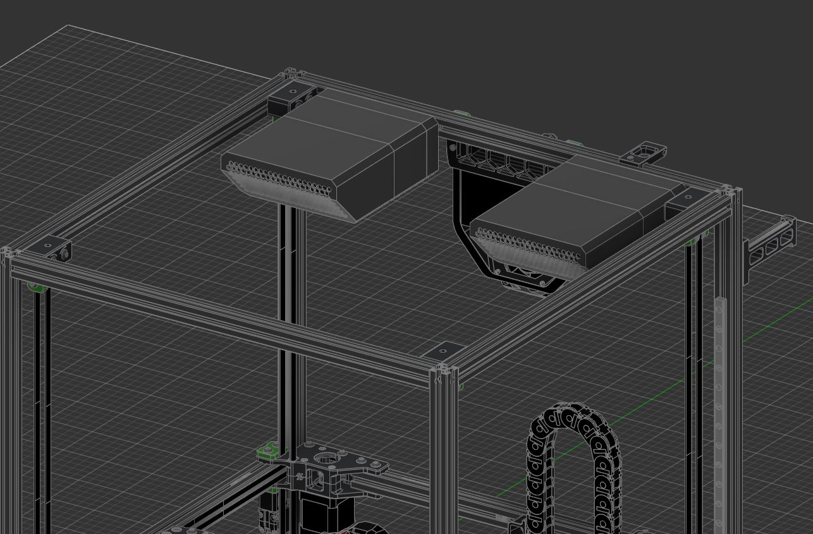
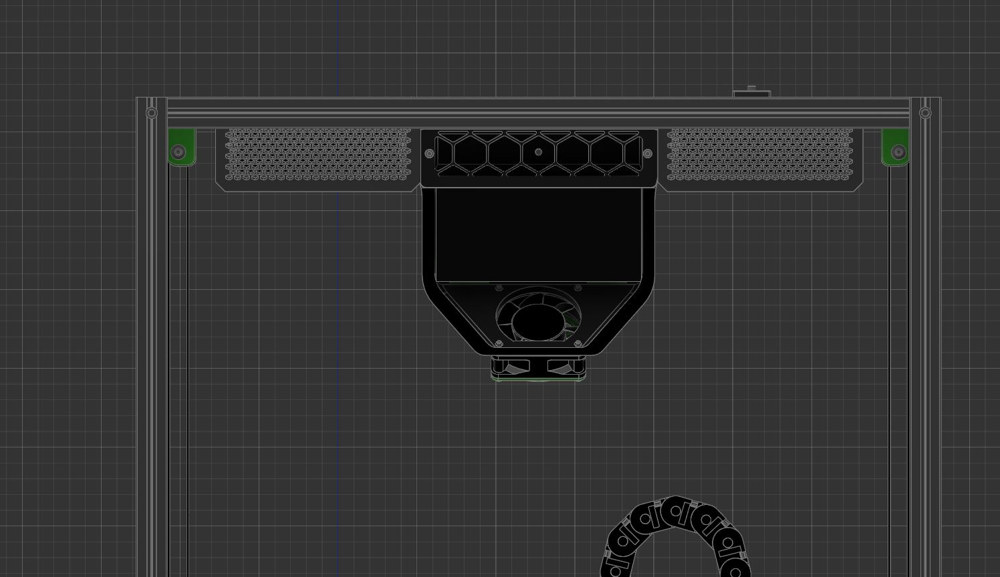
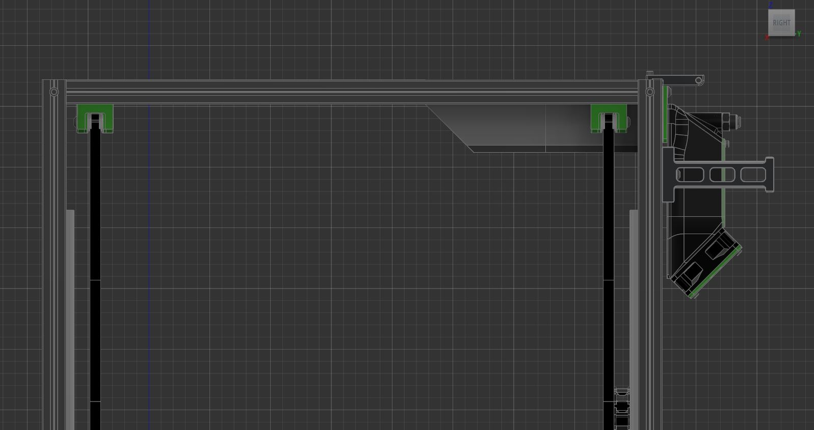

# VOC Scrubber
VOC remover designed to remove fumes where they are most likely to be; right above the print bed for the Voron 2.4

<<UNTESTED! FOR DESIGN REVIEW ONLY!>>

NOTE: This is an untested version and is only for design review! If you do decide to build this and it does not fit, don't say I didn't warn you. 

<<UNTESTED! FOR DESIGN REVIEW ONLY!>> 

## Introduction

If you are like me and had a chance (or did a stupid thing of) sticking your head above the print bed while the printer is running; two things will hit you - heat from the rising air and fumes from the print. Almost all printer filters open source or commercial does the same thing however, they are located near the print bed pulling air from the bottom. However when printing, the hot surface of the bed causes convective air currents to raise from the bed, up and back down the slides of the wall of the printer again. You can see this effect by pushing “wet” filament out a hot nozzle and see where the steam goes - and it is not downwards. So it is rather odd that almost all air filters are designed with the filters drawing air in from the lowest point in the print area/chamber. 

This  “VOC Scrubber” is intended to address just that problem by drawing in hot “dirty” air where they are most likely to go; at the top of the enclosed print space. The following are design choices made for this filter: 

Large quantity of carbon pallet to give longer mean-time-between-service of the filter and slowing down the air speed to maximise collision of VOC particles with the carbon matrix. This is what I call “low volume - high efficiency” filtering
5015 blower fans were chosen to minimise size while having generally higher pressure than axial fans - important due to the high pressure drop across the filter elements
Easily to source generic 40x105x12mm HEPA filter available from AliE to filter carbon dust rather than actual VOC
Allowance to install a simple VOC sensor using either a M2 or M3 screw up to  15x25mm in size
Fans used to pull air through the filter rather than push. 

Currently this is designed for a Voron 2.4 350mm in mind. 

## BOM

- 2x 5015 fans
- 8x 6x3mm (diameter x thickness) neodymium magnets
- 5x M3x5x4mm “standard” Voron heatsets" 
- 2x M3x15mm SHCB
- 3x M3 roll-in T-nut
- 3x M3x30mm SHCB
- 3x M3x25mm SHCB
- 1x HEPA Filter (40x105x12mm)

Optional (if planning to install VOC sensor)

- 1x M3x5x4mm “standard” Voron heatsets" 
- 1x M3x6mm BHCB

OR

- 1x M2x10mm self-tapping screw

## To do & Wishlist:

Slots for 1mm thick foam tape where required to keep air from leaking/lost of pressure
Validate overall fit & finish especially for the VOC sensor + connector type/size to be used
Validate that 4 pairs of magnets are sufficient to hold the carbon pallet canister in place
Investigate impact on input shaping
Validate print settings for the parts (i.e. if standard Voron print settings are sufficient)
Investigate VOC sensor options (i.e. SGP40 or ENS160)
