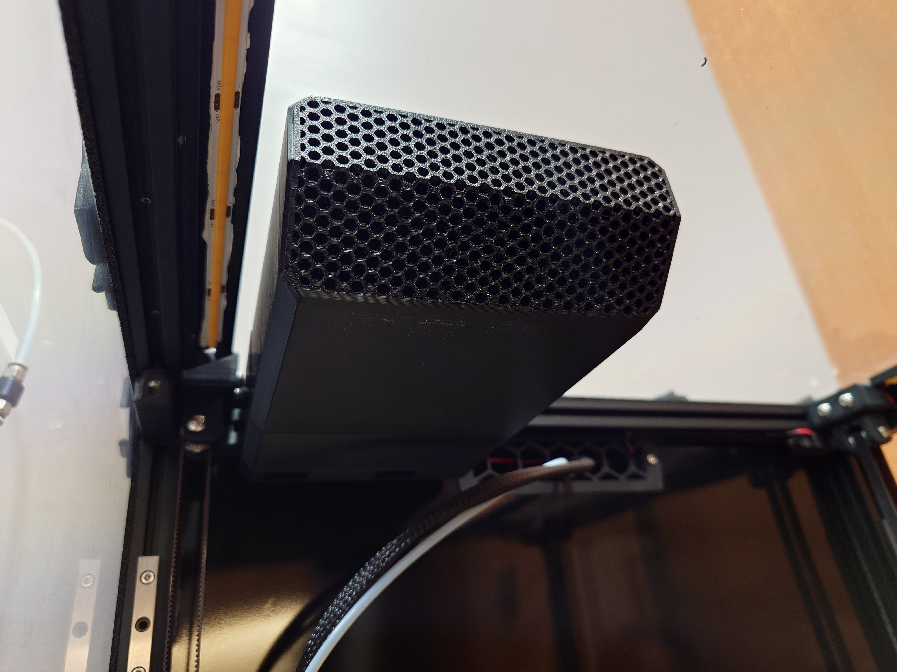
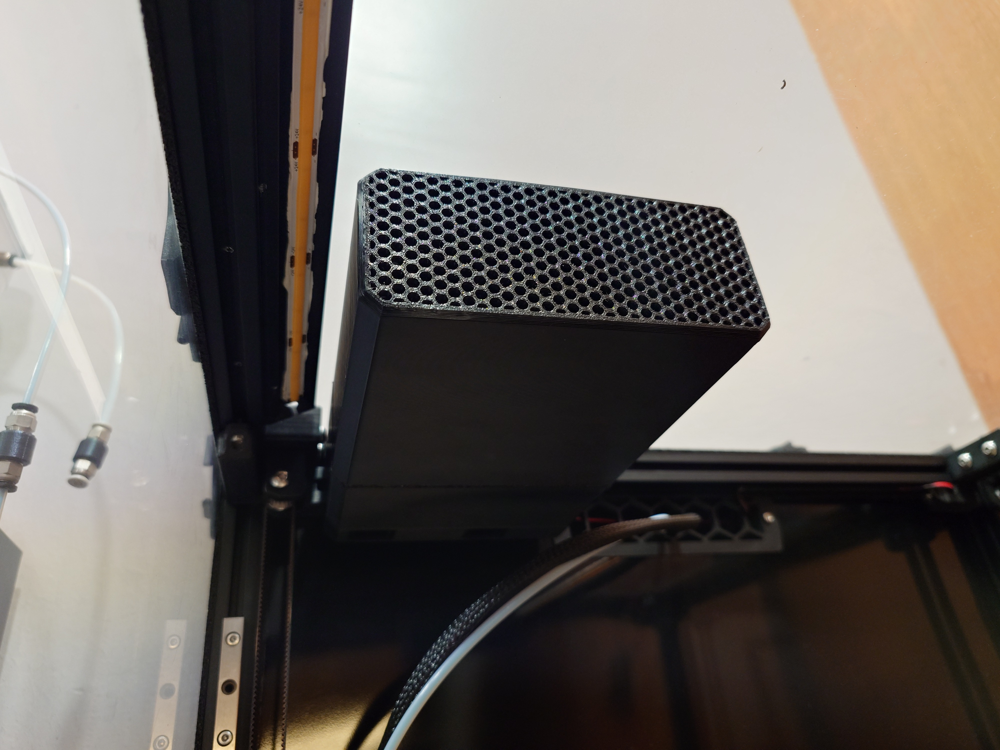
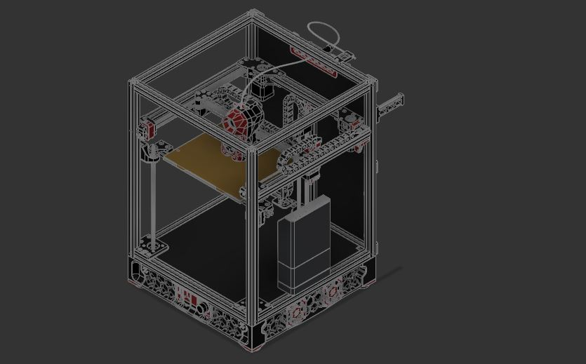
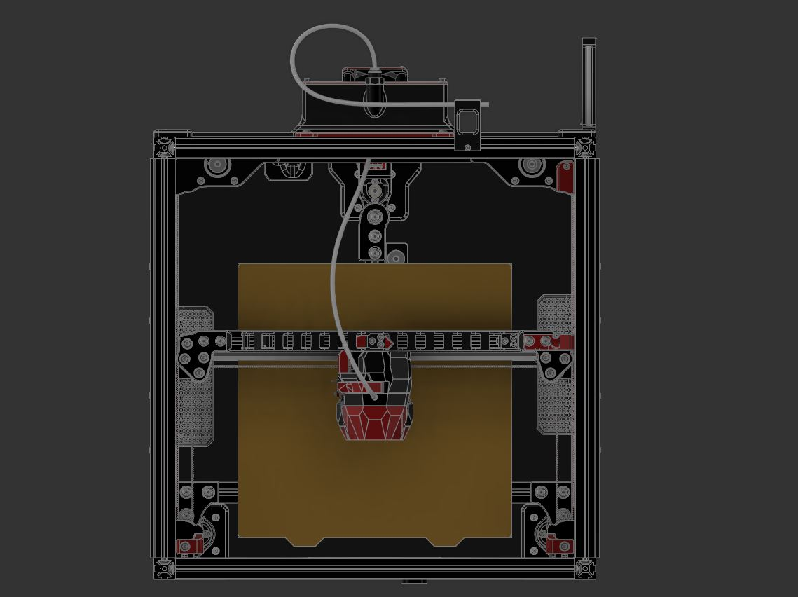

# VOC Scrubber
VOC remover designed to remove fumes where they are most likely to be - right above the print bed.

## Introduction

If you are like me and had a chance (and a rather stupid one) of sticking your head above the print bed while the printer is running; two things will hit you - heat from the rising air and fumes from the print. Almost all current printer filters, open source or commercial, does the same thing however; they are designed to be located near the print bed pulling air from the bottom. However when printing, the hot surface of the bed causes convective air currents to raise from the bed, up and back down the slides of the wall of the printer again (back to simple school level physics). You can see these vapour rise when pushing “wet” filament out a hot nozzle. So it is rather odd that almost all air filters are designed with the filters drawing air in from the lowest point in the print area/chamber. 

This  “VOC Scrubber” is intended to address just that problem by filtering hot “dirty” air where they are most likely to go; at the top of the enclosed print space. The following are design objective for this filter: 

- Large(r) quantity of carbon pallet to give longer mean-time-between-service of the filter. In this case around 850ml of carbon pallets. 
- Intentially use slow air speed to maximise collision of VOC particles with the carbon pallets. 
- 5015 blower fans to minimise the filter size while having generally higher pressure differential to pull air in 
- Easy to source generic 40x105mm HEPA filter available from AliE to filter larger particles
- Allowance to install standard VOC sensors using M3 screws
- Foam seals at joints and connections to minimise and effectively guide the air flow

## Bonus!

It looks like it would fit Tridents too! I unfortunately do not have a Trident but it looks to fit just fine. 

## BOM

Required

- 2x 5015 fans
- 10x 6x3mm (diameter x thickness) neodymium magnets (N54 rated magnets recommended)
- 7x M3x5x4mm “standard” Voron heatset inserts
- 2x M3x15mm SHCB
- 5x M3 roll-in T-nut
- 3x M3x30mm SHCS
- 2x M3x25mm SHCS
- 1x M3x20mm SHCS
- 2x M3x8mm FHCS
- 4x M3x8mm SHCS
- 1x HEPA Filter (40x105x12mm) (there are multiple sources on Aliexpress and some due to measuring errors may say 37x104mm sample: [https://www.aliexpress.us/item/3256801274573326.html](https://www.aliexpress.us/item/3256801274573326.html))
- 1mm thick EVA foam (optional but recommended) (sample [https://www.aliexpress.us/item/2251832698701344.html](https://www.aliexpress.us/item/2251832698701344.html))

Consumables 

- Superglue for magnet installation

Optional (if planning to install VOC sensor - per unit)

- 1x M3x5x4mm “standard” Voron heatsets" 
- 1x M3x6mm BHCB

## Build Notes:
There are two carbon pallet cartridge options and for all intent and purposes, achieve the same purpose. The Cartridge (Flat) option is easier and slightly faster to print while the Cartridge (Angled) was for a more aesthetic look at the risk of it being a harder print. Either is fine and holds roughly the same amount of carbon. 

I have been using it for the past month, and so far I have been very pleased with it. With this I have 3 methods for which I am controlling printing fumes:
1. [The Filter](https://github.com/nateb16/VoronUsers/tree/master/printer_mods/nateb16/THE_FILTER) which has been great to filter VOC will now focus on chamber heating by means of reduced carbon pallets
2. [VEFACH](https://github.com/VoronDesign/VoronUsers/tree/main/printer_mods/KevinAkaSam/VEFACH) will provide negative air pressure to ensure leakages are minimised
3. Finally VOC Scrubber will be used as the main VOC remover in the chamber. 

The build chamber still needs to be sufficiently well sealed to ensure gases do not leak. Currently I can run my VEFACH at 15% and have absolutely no ordour in the room. The only problem I foresee with this mod is the potential loss in print height, but since I almost never print anything taller than 200mm I will probably never know. Fact is printing the carbon pallet cartridges from this mod is the tallest I ever needed to in my 2.4. 

# Update Log 
## v1.0 (Dec 2024)
- Complete ground up redesign of the filter as the changes being made were quite substantial 
- Implemented spacing for foam tape at key areas suspected to be susceptible to leaking air
- Shorter by 5mm by making the whole design flush to the height of a 5015 fan and the fan cowling integral with the hood

## Release for Review (Apr 2024)
- Release candidate to gather feedback on overall design and approach

## To do & Wishlist:
- New cartridge designs with pogo pin connectors to facilitate VOC sensor installation in the cartridge for air intake analysis
- Provide solution to where electronics/PCB controller can be positioned 
- Different HEPA filter that is even easier to source as I notice it being harder to source 40x105mm filters compared to when I first started using them

- ~~Validate print settings for the parts (i.e. if standard Voron print settings are sufficient)~~
- ~~Investigate VOC sensor options (i.e. SGP40 or ENS160)~~
- ~~Slots for 1mm thick foam tape where required to keep air from leaking/lost of pressure~~
- ~~Validate overall fit & finish especially for the VOC sensor + connector type/size to be used~~
- ~~Validate that 4 pairs of magnets are sufficient to hold the carbon pallet canister in place~~
- ~~Investigate impact on input shaping~~
- ~~"Slim" version to minimise print height loss~~
