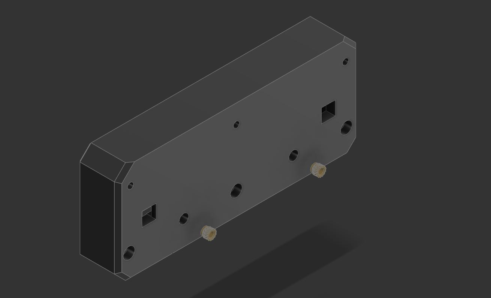
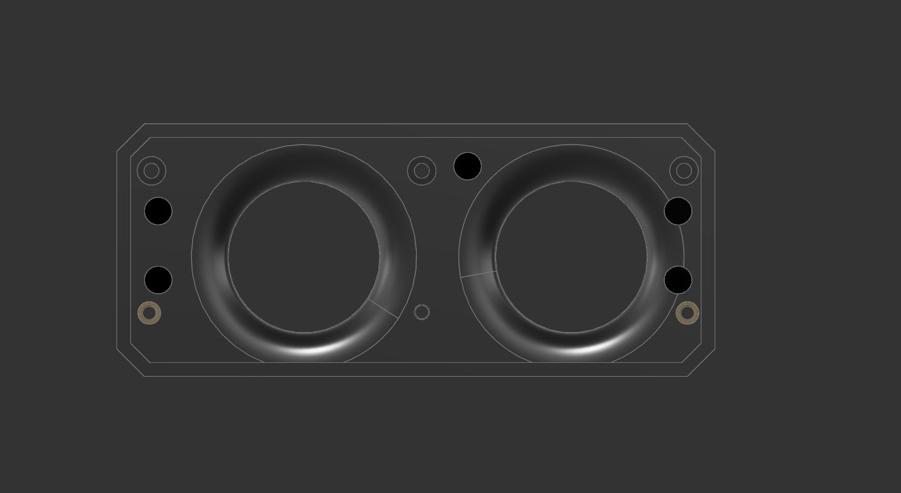
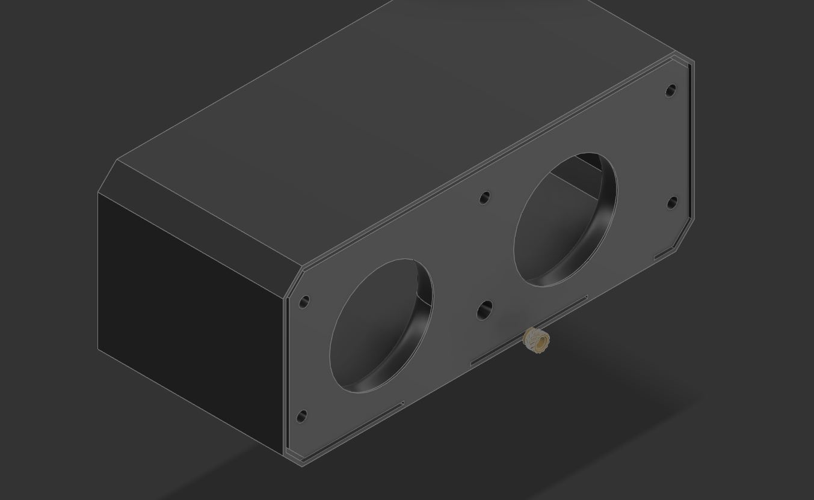
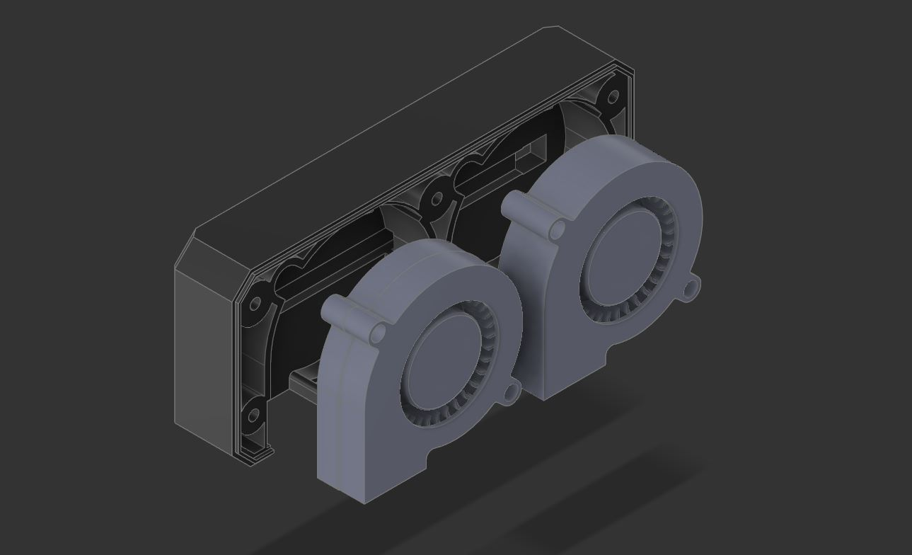
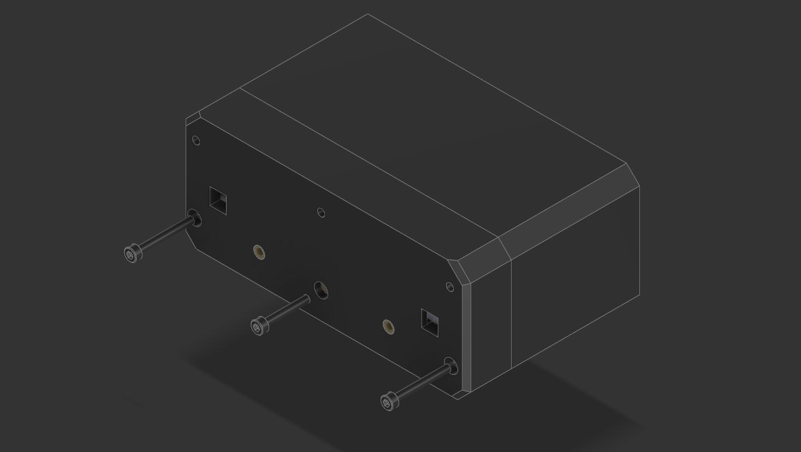
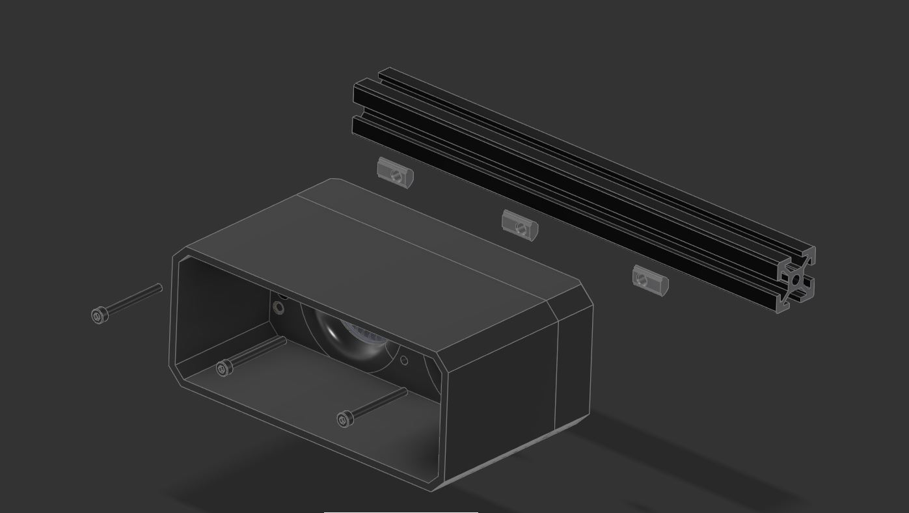
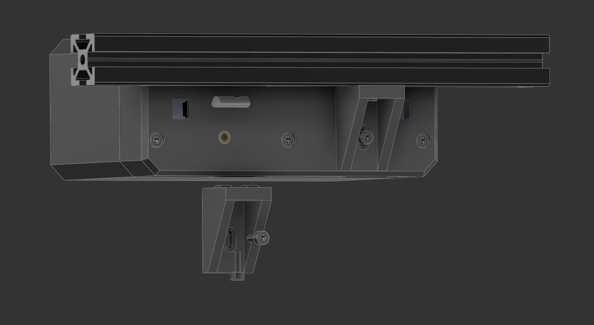
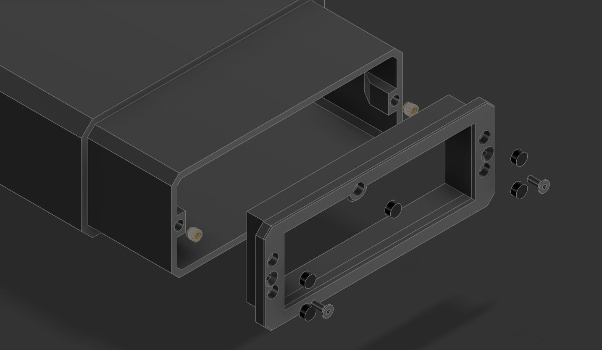
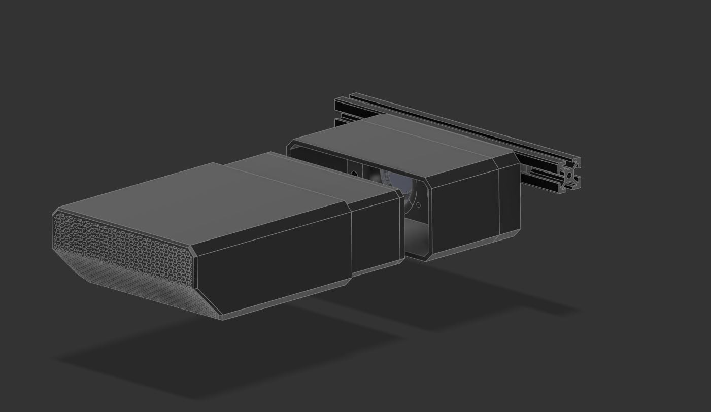

# VOC Scrubber
A Volatile Organic Compound filter made to remove 3D printing fumes where they are most likely to be efficiently.

## Introduction

If you are like me and had a chance (and a rather stupid one) of sticking your head above the print bed while the printer is running; two things will hit you - heat from the rising air and fumes from the print. Almost all current printer filters, open source or commercial, does the same thing however; they are designed to be located near the print bed pulling air from the bottom. However when printing, the hot surface of the bed causes convective air currents to raise from the bed, up and back down the slides of the wall of the printer again (back to simple school level physics). You can see these vapour rise when pushing “wet” filament out a hot nozzle. So it is rather odd that almost all air filters are designed with the filters drawing air in from the lowest point in the print area/chamber. 

This “VOC Scrubber” is intended to address just that problem by filtering hot “dirty” air where they are most likely to go; at the top of the enclosed print space. The "VOC Scrubber" design objectives are: 

- Large(r) quantity of carbon pallet to give longer mean-time-between-service of the filter. In this case around 850ml of carbon pallets. 
- Intentional  use of slow air speed to maximise collision of VOC particles with the carbon pallets in combination with filter media depth to ensure high VOC removal in a single pass.
- 5015 blower fans to minimise the filter size while having generally higher pressure differential to pull air in efficiently across the carbon pallets and HEPA (surprisingly pulls a lot of air through too).
- Easy to source generic 40x105mm HEPA filter available from AliE to filter larger particles
- Direct and linear air paths (no vanes or right angles) allowing for maximum air flow with minimal pressure drops.

The VOC Scrubber has been designed with the Voron v2.4 350mm in mind but should fit any similarly designed 3D printers as long as there is an aluminium profile for it to be attached to. However it may only be possible to install 1 unit in a v2.4 250mm due to space constrains. 

## Bonus!

It looks like it would fit Voron Tridents too! I unfortunately do not have a Trident but it looks to fit just fine. 

## BOM 

Required (Per unit VOC Scrubber) 

- 2x 5015 fans
- 10x 6x3mm (diameter x thickness) neodymium magnets (N54 rated magnets recommended)
- 7x M3x5x4mm “standard” Voron heatset inserts
- 2x M3x15mm SHCB
- 5x M3 roll-in T-nut
- 3x M3x30mm SHCS
- 2x M3x25mm SHCS
- 1x M3x20mm SHCS
- 2x M3x8mm FHCS
- 4x M3x8mm SHCS
- 1x HEPA Filter (40x105x12mm) (there are multiple sources on Aliexpress and some due to measuring errors may say 37x104mm sample: [https://www.aliexpress.us/item/3256801274573326.html](https://www.aliexpress.us/item/3256801274573326.html))

Consumables 

- Superglue for magnet installation

## Build & Install Guide
Refer to the CADs for a better idea about the installation.  

1. Printing is straight forward. Use standard Voron printing parameters in ABS or ASA. The only real decision you will need to make is between the Flat or Angled Cartridge design.
2. Install heatsets into the "Fan Cowling" printed part

3. Intall heatset into the "Fan Hood" printed part (2 on the lower portion next to the walls in yellow). These are very tricky to install, but if you hold your soldering iron at an angle you will be able to catch the heatsets and slowly push it into position. Install magnets (in black) - dont forget to check the polarity.

4. Decide which side of your printer you are installing and where the wires will run out from. The "Fan Cowling" has two exit holes to choose from. Wire the fans in parallel. The fans are fit in place for GDSTime fans, but if it is too lose just use some foam tape to fill out the gap as long as it secures the fan. 

5. Once you have tested that the fans are working when powered, join the "Fan Cowling" and "Fan Hood" and screw from the back of the "Fan Cowling" using 2x M3x25mm SHCS on the sides and 1x M3x20mm SHCS at the middle.

6. Attach the assembly to the 2020 frame using roll-in T-Nuts or Hammer T-Nuts and 3x M3x30mm SHCS. Run your cables and connect accordingly and test again to make sure they still work. 

6a. (Optional) Install the "Frame Brace" using 4x M3x8mm SHCS. It may take some time to align them as you will be installing them from 2 different planes. I mark this as optional as I personally have been running my VOC Scrubbers without them and have no issues in stability. 

7. Assemble the cartridge with heatsets. Install the magnets (in black - CHECK THE POLARITY BEFORE INSTALLING), install the HEPA filter, fill with activated carbon pallets and cover it with 2x M3x8mm FHCS. 

8. The cartridge should slide into the "Fan Hood" and held in place by the magnets. The whole assemble should also not wobble.

## Config & Macro(?)
I do not actually use any macros to actively control my fans. Rather my pre-heat macros just turns on the fans at 50%, and Print_Start turns it down to about 30% throughout the print job. 

## Notes:
There are two carbon pallet cartridge options and for all intent and purposes, achieve the same purpose. The Cartridge (Flat) option is easier and slightly faster to print while the Cartridge (Angled) was for a more aesthetic look at the risk of it being a harder print. Either is fine and holds roughly the same amount of carbon. 

I have been using it for the past month, and so far I have been very pleased with it. With this I have 3 methods for which I am controlling printing fumes:
1. [The Filter](https://github.com/nateb16/VoronUsers/tree/master/printer_mods/nateb16/THE_FILTER) which has been great to filter VOC will now focus on chamber heating by means of reduced carbon pallets
2. [VEFACH](https://github.com/VoronDesign/VoronUsers/tree/main/printer_mods/KevinAkaSam/VEFACH) will provide negative air pressure to ensure leakages are minimised through leaks.
3. Finally VOC Scrubber will be used as the main VOC remover in the chamber. 

The build chamber still needs to be sufficiently well sealed to ensure gases do not leak. Currently I can run my VEFACH at 15% and have absolutely no ordour in the room. The only problem I foresee with this mod is the potential loss in print height, but since I almost never print anything taller than 200mm I will probably never know. Fact is, printing the carbon pallet cartridges from this mod is the tallest I ever needed to in my 2.4. 

# Update Log 

## v1.2 (Mar 2025)
- Corrected some minor tolerance issues on the Cartridge cover for the FHCS and made the cover just slightly thinner (0.5mm) for clearance issue.
- Got rid of the Foam insert on the Cartridge to make it easier to build with less parts. 

## v1.1 (Feb 2025)
- Decided to position the air sensors at the exhaust VOC filter which I am in the process of designing hence the sensor on the Scrubber is mooted - removed internal sensor placement and wiring pass throughs.
- Increased clearance in the Fan Hood between the cartridge and 5015 fans by 1.5(?)mm.
- Reworked existing wiring pass through of the Fan Cowling for a cleaner design.
- Other aesthetic cleanups with no performance impact.

## v1.0 (Dec 2024)
- Complete ground up redesign of the filter as the changes being made were quite substantial 
- Implemented spacing for foam tape at key areas suspected to be susceptible to leaking air
- Shorter by 5mm by making the whole design flush to the height of a 5015 fan and the fan cowling integral with the hood

## Release for Review (Apr 2024)
- Release candidate to gather feedback on overall design and approach

## To do & Wishlist:
- Different HEPA filter that is even easier to source as I notice it being harder to source 40x105mm filters compared to when I first started using them

- ~~Validate print settings for the parts (i.e. if standard Voron print settings are sufficient)~~
- ~~Investigate VOC sensor options (i.e. SGP40 or ENS160)~~ 
- ~~Slots for 1mm thick foam tape where required to keep air from leaking/lost of pressure~~
- ~~Validate overall fit & finish especially for the VOC sensor + connector type/size to be used~~
- ~~Validate that 4 pairs of magnets are sufficient to hold the carbon pallet canister in place~~
- ~~Investigate impact on input shaping~~
- ~~"Slim" version to minimise print height loss~~
